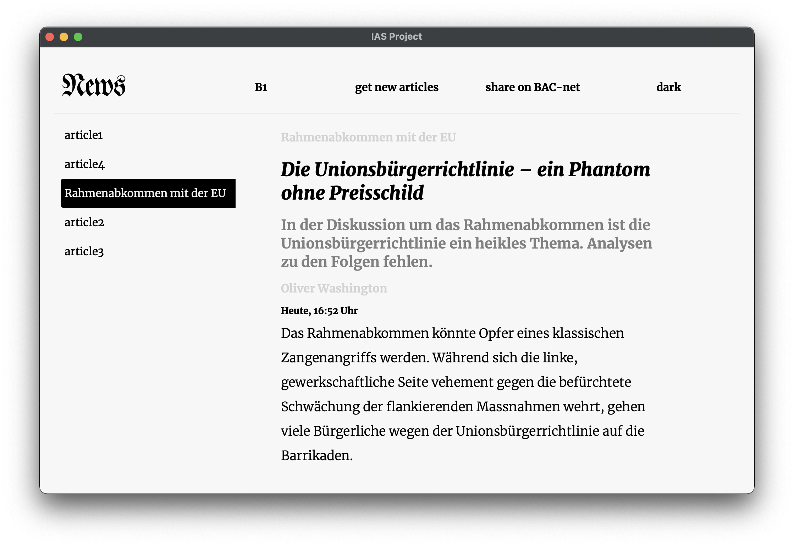
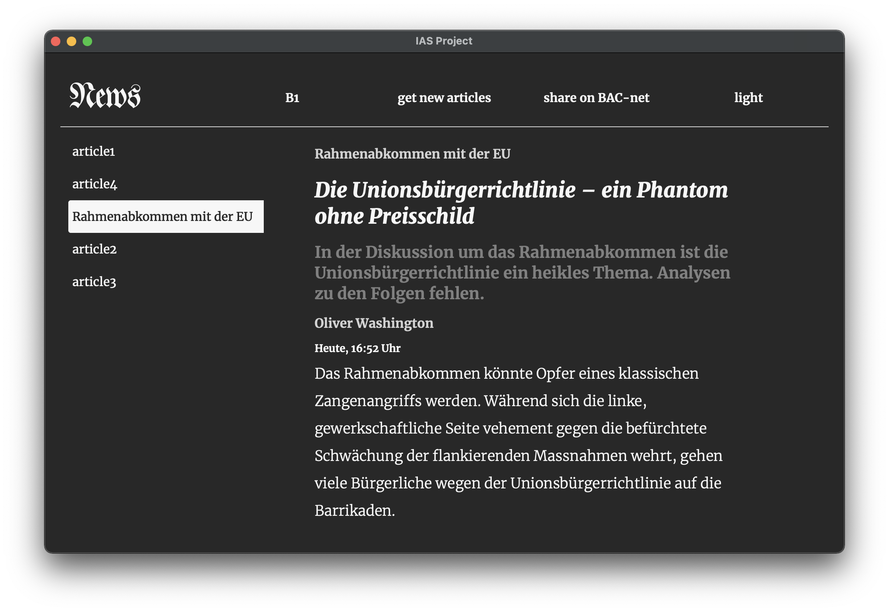

# IAS Project

by Simon Laube, Philipp Weber and Maximilian Barth

---

Run the program with the following command (in top folder):\
poetry run python news_scraper/main.py

---

## Feature Ideas

### Essential
- [ ] article class
- [ ] article to QT HTML
- [ ] delete articles
- [ ] BAC net integration
- [ ] bluetooth article transmission
- [ ] local network article transmission
- [ ] download new articles

### Nice to have
- [ ] article signature for authenticity
- [ ] source logo, theme 
- [ ] sort articles by category
- [ ] bookmark articles
- [ ] many news sources
- [ ] read indication
- [ ] save settings
- [ ] custom themes

---

## Dependencies

PyQt5 - pip3 install PyQt5

---
## Progress 13.04.2021

