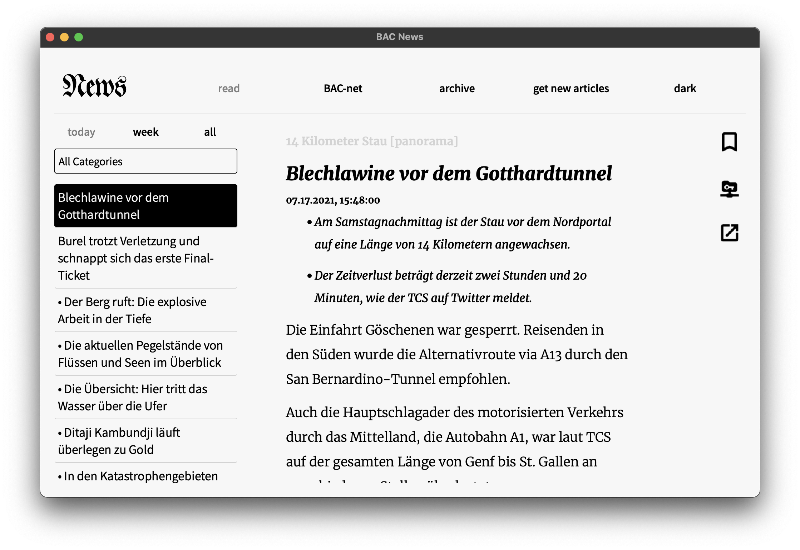
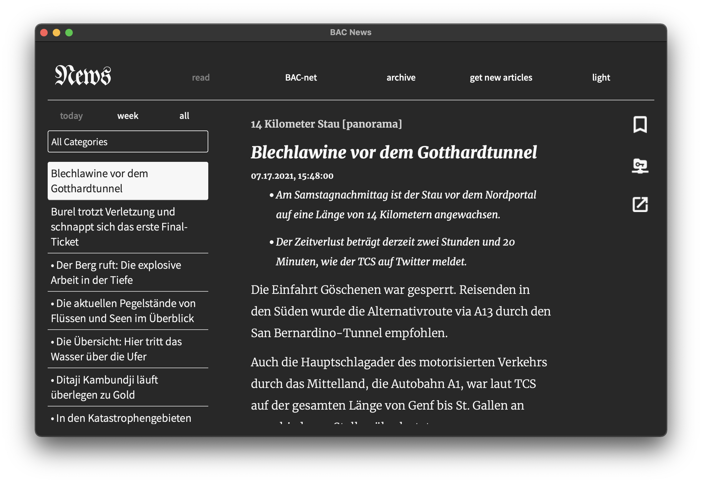

# A newsreader for the BAC-net

Easily download articles from SRF and share them with other users via LAN, Bluetooth or BAC-net.

- [ ] BAC net integration
- [ ] bluetooth article transmission
- [x] local network article transmission
- [x] download articles
- [x] loading animation when scraping
- [x] only download new articles
- [x] logic interface for GUI
- [x] option to stop server

## GLOBAL TODO
- [x] add server timeouts in order to easily close servers

## Simon
- [x] implement lan server as class
- [x] implment lan client as class

## Philipp
- [x] implement bluetooth server as class
- [x] implement bluetooth client as class

## Max
- [x] article filter in read section
- [x] sort article by date
- [x] bookmark articles in reader
- [x] remove srf button in share section
- [x] format li elements
- [x] fix srf button in server section
- [x] display bookmarked articles in archive
- [x] read indication
- [x] filter by category
- [x] implement archive section
- [x] fix bugs with dark mode and switches
- [x] implement gui for lan server
- [x] implement gui for lan client
- [x] move reading dots to beginning of title  
- [x] style btn color consistency
- [x] close server on application termination
- [x] srf button on resize    
- [x] archive sort articles  
- [x] stop loading animation when done downloading
- [x] code refactoring
- [x] implement downloading screen LAN
- [x] implement gui for bluetooth server
- [x] implement gui for bluetooth client
- [x] implement downloading screen bluetooth
- [x] style MAC error message
- [x] message if download via LAN failed
- [x] move appropriate functions to utils
- [x] refactoring of utils
- [x] manual input of IP address
- [x] open article into own window
- [x] more keyboard shortcuts
---
---
- [ ] message if download via BT failed  
- [ ] improve category filter efficiency
- [ ] remove bluetooth btn from mac os

## difficult to fix
- [ ] fix bookmark color in dark mode  
